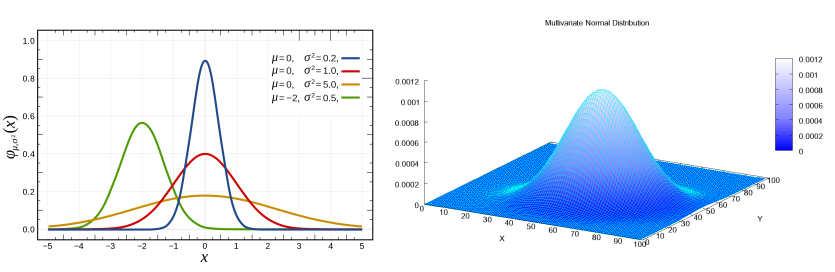

## 习题1

### 1. 有线性方程$Ax=b$，若已知$A,b$，需要求解$x$，该如何求解？这对$A$和$b$有哪些要求？提示：从$A$的维度和秩角度来分析

有解的条件：$b$位于$col(A)$的空间内。

至于如何求解，请随便找本线性代数的数即可。（存在无穷解时：可以利用高斯消去法）

### 2. 高斯分布是什么?它的一维形式是什么样子?它的高维形式是什么样子?

> 可以查看：[高斯分布-wiki](https://zh.wikipedia.org/wiki/%E6%AD%A3%E6%80%81%E5%88%86%E5%B8%83)，[多维高斯分布](https://en.wikipedia.org/wiki/Multivariate_normal_distribution)

一维形式：
$$
f(x;\mu,\sigma)=\frac{1}{\sigma \sqrt{(2\pi)}}\exp(-\frac{(x-\mu)^2}{2\sigma^2})
$$
多维形式：
$$
f(x_1,...,x_k)=\frac{\exp(-\frac{1}{2}(x-\mu)^T\Sigma^{-1}(x-\mu))}{\sqrt{(2\pi)^k|\Sigma|}}
$$

### 3. 你知道 C++ 的类吗?你知道 STL 吗?你使用过它们吗?

略

### 4. 你以前怎样书写 C++ 程序?(你完全可以说只在 VC6.0 下写过 C++ 工程,只要你有写 C++ 和 C 语言经验就行。)
略

### 5. 你知道 C++11 标准吗?其中哪些新特性你之前听说过或使用过?有没有其他的标准?
略

### 6. 你知道 Linux 吗?你有没有至少使用过其中之一(安卓不算),比如 Ubuntu?

略

### 7. Linux 的目录结构是什么样的?你知道哪些基本命令,比如 ls, cat 等等?

> 请查看：[Linux教程](http://www.runoob.com/linux/linux-system-contents.html)

### 8. 如何在 Ubuntu 中安装软件(不打开软件中心的情况下)?这些软件被安装在什么地方?当我只知道模糊的软件名称(比如我想要装一个 eigen 名称的库),我应该如何安装它?

略。（难道不是直接Google or Baidu吗？）

### 9. (*) 花一个小时学习一下 Vim,因为你迟早会用它。你可以在终端中输入 vimtutor 阅读一遍所有内容。我们不需要你非常熟练地操作它,只要在学习本书的过程中使用它键入代码即可。不要在它的插件上浪费时间,不要想着把 vim 用成 IDE,我们只用它做文本编辑的工作。

> 清查考：[Linux-vim](http://www.runoob.com/linux/linux-vim.html)

