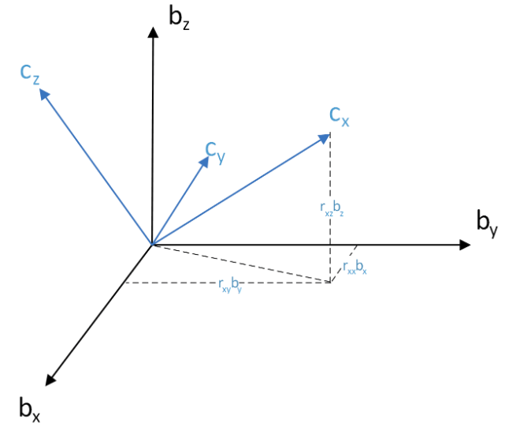
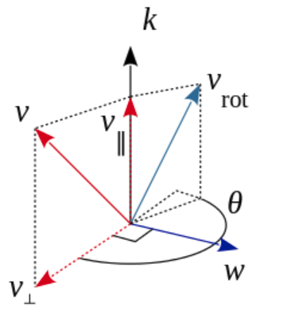
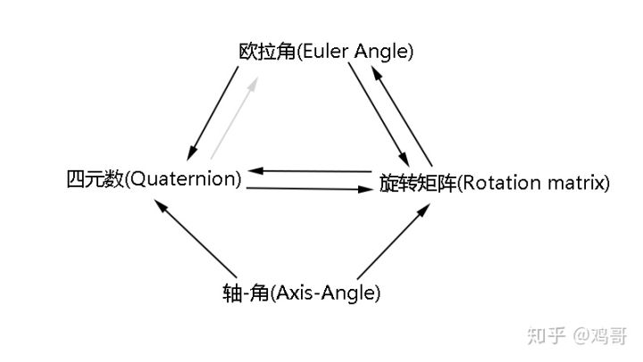
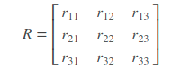
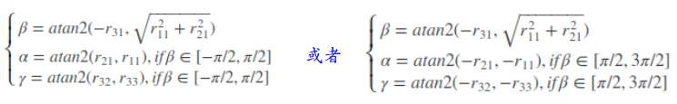
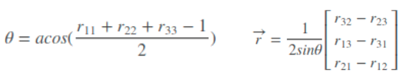
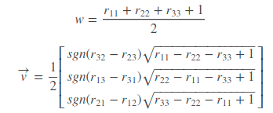
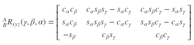
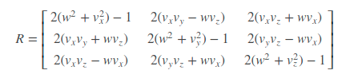
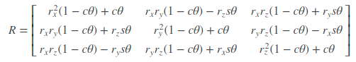

## 习题3

### 1. 验证旋转矩阵的正交矩阵

根据式子3.5我们知道旋转矩阵可以表示成：
$$
R=\begin{bmatrix} e_1^Te^{'}_1&e_1^Te^{'}_2&e_1^Te^{'}_3\\e_2^Te^{'}_1&e_2^Te^{'}_2&e_2^Te^{'}_3\\e_3^Te^{'}_1&e_3^Te^{'}_2&e_3^Te^{'}_3 \end{bmatrix}
$$
要验证R为正交矩阵，等价于验证$RR^T=I$。那我们不妨先写出$A=RR^T$的形式（为了简便，只写出$A_{ij}$）：
$$
A_{ij}=e_i^Te_1^{'}e_1^Te_j^{'}+e_i^Te_2^{'}e_2^Te_j^{'}+e_i^Te_3^{'}e_3^Te_j^{'}=(e_1^{'}+e_2^{'}+e_3^{'})^T(e_i e_j^T)(e_1^{'}+e_2^{'}+e_3^{'})
$$
① 当$i=j$时：
$$
A_{ii}=e_i^Te_1^{'}e_1^Te_i^{'}+e_i^Te_2^{'}e_2^Te_i^{'}+e_i^Te_3^{'}e_3^Te_i^{'}=(e_1^{'}+e_2^{'}+e_3^{'})^T(e_ie_i^T)(e_1^{'}+e_2^{'}+e_3^{'})
$$
由于$e_ie_i^T$只有第i行第i列为1，其余均为0；所以相当于$(e_1^{'}+e_2^{'}+e_3^{'})$第i行的平方；而又因为$e_1^{'},e_3^{'},e_3^{'}$为单位正交坐标系，所有其每行之和均为1。所以有$A_{ii}=1$

② 当$i!=j$时：
$$
A_{ij}=(e_1^{'}+e_2^{'}+e_3^{'})^T(e_i e_j^T)(e_1^{'}+e_2^{'}+e_3^{'})
$$
因为$i!=j$，所以$e_ie_j^T=0$；所以$A_{ij}=0$

所以得证！！！

> 注：$e_1,e_2,e_3$只要为单位正交坐标系即可（不必$[1,0,0], [0, 1,0], [0, 0, 1]$），但上述为了简化，采用的$e_1,e_2,e_3$为$[1,0,0], [0, 1,0], [0, 0, 1]$

### 2. 寻找罗德里格斯公式的推导过程并加以理解

> 来自：[罗德里格斯公式 理解、推导](https://blog.csdn.net/q583956932/article/details/78933245)，[wiki](http://www.wikiwand.com/en/Rodrigues%27_rotation_formula)

**罗德里格斯公式（Rodriguez formula）**公式为：
$$
R=I+sin(\theta)K+(1-cos(\theta))K^2
$$

> 关于K的含义后续会说明

#### ① 由于要描述的都是旋转问题，那么先来看下什么是旋转



说白了就是坐标系进行了刚性旋转（坐标系B到坐标系C，不妨假设坐标系B为$[1,0,0;0,1,0;0,0,1]$），那么对应的坐标转换矩阵R存在下述关系：
$$
C=RB=\begin{bmatrix}r_{xx}&r_{xy}&r_{xz}\\ r_{yx}&r_{yy}&r_{yz}\\r_{zx}&r_{zy}&r_{zz} \end{bmatrix}\begin{bmatrix} b_x&b_y&b_z\end{bmatrix}
$$

> 其中的$b_x$等均为了列向量

根据线性代数的定义，旋转矩阵$R$就是从基向量矩阵$B$到基向量矩阵$C$的过渡矩阵。由于旋转矩阵$R$是标准3阶正交矩阵，故旋转矩阵$R$的自由度为3，这说明最少可以用三个变量来表示旋转矩阵$R$，这就是**罗德里格斯公式（Rodriguez formula）**存在的基础。

**罗德里格斯公式（Rodriguez formula）**首先要确定一个三维的单位向量$k=[k_x,k_y,k_z]^T$（两个自由度---因为单位向量）和一个标量$\theta$（一个自由度）

#### ② 证明罗德里斯公式



先考虑对一个向量作旋转，其中 $v$ 是原向量，三维的单位向量 $k=[k_x,k_y,k_z]^{T}$是旋转轴， $\theta$是旋转角度，$v_{rot}$是旋转后的向量。

1. 将$v$分解成$v_{\parallel}$(相对$k$)和$v_{\perp}$:（顺便定义与k，v垂直的向量）
   $$
   v_{\parallel}=(v\cdot k)k \\
   v_{\perp} = v-v_{\parallel}=-k\times (k\times v) \\
   w=k\times v
   $$

2. 不难看出来$v_{\parallel},v_{\perp},w$三者互相正交。从而不难通过图上的关系知：
   $$
   v_{rot}=v_{\parallel}+cos(\theta)v_{\perp}+sin(\theta)w
   $$

3. 将1中$v_\parallel$改写成$\times$乘的形式$v_\parallel =v+k\times(k\times v)$（其实就是1中第二条式子）。在代入2不难得到：
   $$
   v_{rot}=v+k\times(k\times v)-cos(\theta)k\times(k\times v)+sin(\theta)k\times v
   $$

4. 正如式子3.3引入的$\land$符号，我们也可以将$k$表示成$K=k\land$：（满足$k\times v=Kv$）
   $$
   \begin{bmatrix} 0&-k_z&k_y\\ k_z&0&-k_x\\ -k_y&k_x&0\end{bmatrix}
   $$

5. 将4代入3中，就可以“改写”成：
   $$
   v_{rot}=v+(1-cos(\theta))K^2v+sin(\theta)Kv=(I+(1-cos(\theta))K^2+sin(\theta)K)v
   $$

   > 关于$k\times (k\times v)=K^2v$你可以自己带进去验证一下

所以就可以得到：$R=I+sin(\theta)K+(1-cos(\theta))K^2$

> 但显然上面的式子和课本上的3.14形式上并不一样。下面我们可以稍微变化一下。
>
> 对于2，我们可以写成下述等价形式：
> $$
> v_{rot}=v_{\parallel}+cos(\theta)v_{\perp}+sin(\theta)w=v_\parallel+cos(\theta)(v-v_\parallel)+sin(\theta)k\times v\\=cos(\theta)v+(1-cos(\theta))v_\parallel+sin(\theta)k\times v
> $$
> 其中$v_\parallel$是$v$在$k$上的投影，所有可以写成$kk^Tv/(k^Tk)=kk^T/v$，所以代入就可以得到：
> $$
> v_{rot}=(cos(\theta)I+(1-cos(\theta))kk^T+sin(\theta)k\land) v
> $$
> 所以有$R=cos(\theta)I+(1-cos(\theta))kk^T+sin(\theta)k\land$

### 3. 验证四元数旋转某个点后，结果是一个虚四元数（实部为零），所以仍然对应到一个三维空间点（式3.34）

其实题目的意思就是证明$p^{'}=qpq^{-1}$的实部等于0。再证明之前，我们先给出各个四元数：
$$
q=[cos\frac{\theta}{2},cos\frac{\theta}{2},cos\frac{\theta}{2},cos\frac{\theta}{2}]\\
p=[0,x,y,z]\\
q^{-1}=[cos\frac{\theta}{2},-cos\frac{\theta}{2},-cos\frac{\theta}{2},-cos\frac{\theta}{2}]/(4(cos\frac{\theta}{2})^2)
$$

> 关于$q^{-1}$请看式子3.29

下面我们将四元数的乘法（式子3.23写成矩阵形式）：
$$
q_aq_b=[s_a,x_a,y_a,z_a]\begin{bmatrix}s_b&x_b&y_b&z_b\\ -x_b&s_b&-z_b&y_b \\-y_b&z_b&s_b&-x_b\\ -z_b&-y_b&x_b&s_b \end{bmatrix}
$$
那么现在写出$qpq^{-1}$的式子：
$$
qpq^{-1}=cos\frac{\theta}{2}[1, 1, 1, 1]\begin{bmatrix}0&x&y&z\\ -x&0&-z&y \\-y&z&0&-x\\ -z&-y&x&0 \end{bmatrix}cos\frac{\theta}{2}/(4(cos\frac{\theta}{2})^2)\begin{bmatrix}1&1&-1&-1\\ 1&1&1&-1 \\1&-1&1&1\\ 1&-1&-1&1 \end{bmatrix}
$$
很显然可以知道实部的结果为：
$$
[-x-y-z, z+y-x,x+y-z,z+y-x][1, 1, 1, 1]^T=0
$$
所以得证。

### 4. 画表总结旋转矩阵，轴角，欧拉角，四元数的转换关系

> 可以查看：[三维旋转：欧拉角、四元数、旋转矩阵、轴角之间的转换](https://zhuanlan.zhihu.com/p/45404840)



下述假设旋转矩阵为：



① 旋转矩阵转换为欧拉角



② 旋转矩阵转为 轴-角



③ 旋转矩阵转为四元数



④ 欧拉角转为旋转矩阵



⑤ 四元数转为旋转矩阵



⑥ 轴-角 转化为旋转矩阵



### 5. 假设有一个大的Eigen矩阵，想把它的左上角$3\times 3$的块取出来，然后赋值为$I_{3\times 3}$。请编程实现

```cpp
#include <iostream>
#include "Eigen/Core"

using namespace std;

int main() {
    const int N = 10;
    Eigen::MatrixXf mat(N, N);
    Eigen::MatrixXf ide = Eigen::Matrix<float, 3, 3>::Identity();
    mat.block<3, 3>(0, 0) = ide;    // 这句是关键
    cout << mat << endl;
}
```

### 6. 一般解线性方程$Ax=b$有哪几种做法？ 你能在Eigen中实现吗？

> 这部分参考自：[一块灰色的石头](https://www.cnblogs.com/newneul/p/8306442.html)

第一大类：直接求解的方式

① 求逆法：$Ax=b\to x=A^{-1}b$

```cpp
// 1. inverse method
MatrixXd method1(const MatrixXd &A, const MatrixXd &b) {
    return A.inverse() * b;
}
```

> 必须是方阵，$A$满秩

② QR分解法：适合非方阵和方阵 当方程组有解时的出的是真解，若方程组无解得出的是近似解

```cpp
// 2. QR
MatrixXd method2(const MatrixXd &A, const MatrixXd &b) {
    return A.colPivHouseholderQr().solve(b);
}
```

③ 最小二乘法：适合非方阵和方阵，方程组有解时得出真解，否则是最小二乘解(在求解过程中可以用QR分解 分解最小二成的系数矩阵)

```cpp
// 3. least-square
MatrixXd method3(const MatrixXd &A, const MatrixXd &b) {
    return (A.transpose() * A).inverse() * (A.transpose() * b);
}
```

④ LU分解：只能为方阵（满足分解的条件才行）

```cpp
// 4. LU
MatrixXd method4(const MatrixXd &A, const MatrixXd &b) {
    return A.lu().solve(b);
}
```

⑤ Cholesky分解：只能为方阵 (结果与其他的方法差好多)

```cpp
// 5. Cholesky
MatrixXd method5(const MatrixXd &A, const MatrixXd &b) {
    return A.llt().solve(b);
}
```

第二类：迭代方式

⑥ Jacobi迭代

TODO


### 7. 设有小萝卜一号和小萝卜二号位于世界坐标系中。小萝卜一号的位姿为$q_1=[0.35,0.2,0.3,0.1]$，$t_2=[0.3,0.1,0.1]^T$（q的第一项为实部。请把q归一化后再进行计算）。这里的$q$和$t$表达的是$T_{cw}$，也就是世界坐标系到相机坐标系的变换关系。小萝卜二号的位姿为$q_2=[-0.5,0.4,-0.1, 0.2]$, $t=[-0.1,0.5,0.3]^T$。现在，小萝卜一号看到某个点在自身的坐标系下坐标为$p=[0.5, 0, 0.2]^T$，求该向量在小萝卜二号坐标系下的坐标。请编程实现。

其实只要缕清下述关系即可。

1. 将小萝卜一号自身坐标系$p_{c1}$（就是$p$）转到世界坐标系中$p_w$。此时对应的转换关系为：$p_w=T_{c1w}^{-1}p_{c1}$
2. 将世界坐标系下的$p_w$转到小萝卜二号的坐标系下面$p_{c2}$，此时对应的转换关系为：$p_{c2}=T_{c2w}p_w$
3. 将上述两步合并在一起就是：$p_{c2}=T_{c2w}T_{c1w}^{-1}p_{c1}$

```cpp
#include <iostream>
#include <Eigen/Dense>

using namespace std;
using namespace Eigen;

int main() {
    Quaterniond q1(0.2, 0.3, 0.1, 0.35);
    Quaterniond q2(0.4, -0.1, 0.2, -0.5);
    // 归一化
    q1.normalize();
    q2.normalize();
    Vector3d t1(0.3, 0.1, 0.1);
    Vector3d t2(-0.1, 0.5, 0.3);
	
    // 定义转换矩阵
    Isometry3d Tc1w = Isometry3d::Identity();
    Isometry3d Tc2w = Isometry3d::Identity();

    Tc1w.rotate(q1);
    Tc1w.translate(t1);
    Tc2w.rotate(q2);
    Tc2w.translate(t2);

    // 计算坐标转换
    Vector3d p(0.5, 0, 0.2);
    auto pw = Tc1w.inverse() * p;
    auto pc2 = Tc2w * pw;
    cout << pc2.transpose() << endl;
}
```

