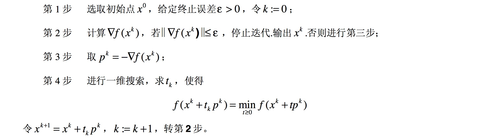
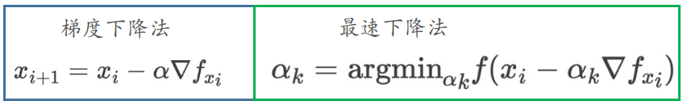
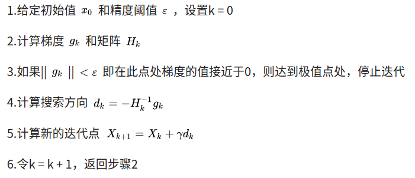
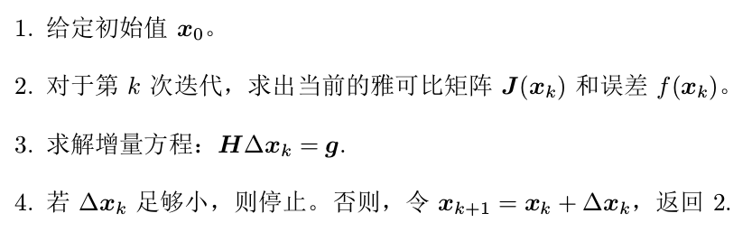
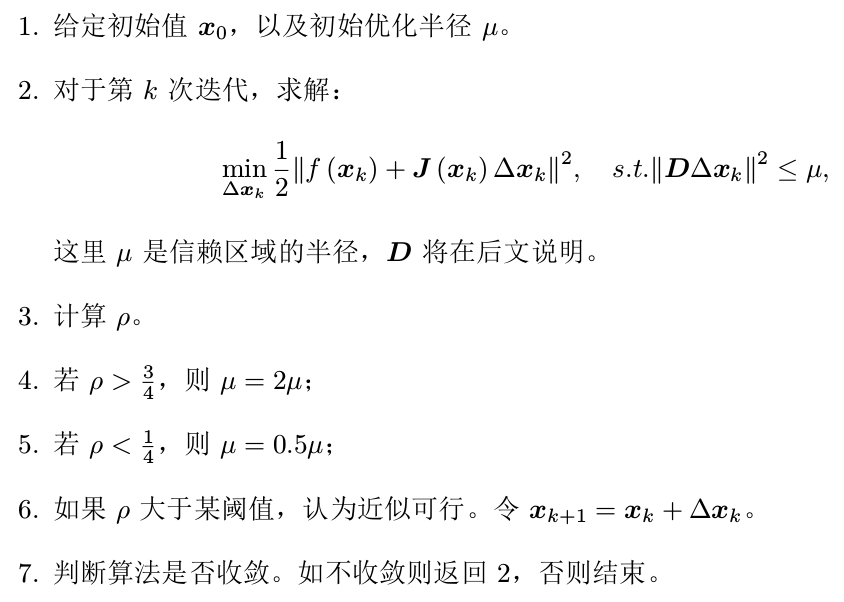

## 习题6

### 1. 证明线性方程$Ax = b$当系数矩阵$A$超定时,最小二乘解为$x = (A^T A)^{−1} A^T b$.

先理清正定，超定，欠定矩阵这几个概念：

- 正定矩阵：设$M$是$n$阶方阵，如果对任何非零向量$z$，都有 $z^TMz>0$，就称$M$正定矩阵。
- 超定方程组：方程个数大于未知量个数的方程组（这里的方程个数应该理解为有效的方程个数）
- 欠定方程组：方程个数小于未知量个数的方程组

最小二乘是为了使得$e=\Vert b-Ax\Vert^2_2$最小。那么采用下面步骤进行证明：

1. 充分性，假设$x^\star=(A^TA)^{-1}A^Tb$为上述方差的解，并假设存在其他解$x$使得$e_x\lt e_{x^\star}$，且令$\Delta x=x-x^\star$，那么：
   $$
   e_x=\Vert b-Ax\Vert^2_2=\Vert b-A(x^\star+\Delta x)\Vert^2_2=(b-Ax^\star-A\Delta x)^T(b-Ax^\star-A\Delta x)\\=(b-Ax^\star)^T(b-Ax^\star)-2(A\Delta x)^T(b-Ax^\star)+(A\Delta x)^T(A\Delta x)\\=\Vert b-Ax^\star\Vert^2_2+\Vert A\Delta x\Vert_2^2
   $$
   显然$e_x=e_{x^\star}+\Vert A\Delta x\Vert^2_2>e_{x^{\star}}$，所以与假设矛盾。得证

   > 上述用了$A(A^TA)^{-1}A^T=I$

2. 必要性：

$$
Ax=b\to A^TAx=A^Tb\to x=(A^TA)^{-1}A^Tb
$$

所以得证。

### 2. 调研最速下降法、牛顿法、高斯牛顿法和列文伯格-马夸尔特方法各有什么优缺点。除了我们举的 Ceres 库和g2o 库,还有哪些常用的优化库?你可能会找到一些 MATLAB 上的库。

下面分别重新回顾一下这几种优化方法：

#### 最速下降法

**优点：**只需要一阶导数，计算快。当目标函数是凸函数时，最速下降法的解为全局最优解

**缺点：**在开头几步，目标函数下降较快；但在接近极小点时，收敛速度就不理想了。特别当遇到目标函数的等值 线为比较扁平的椭圆时，收敛就更慢了。

> 需要说明一下，从概念上而言梯度下降法和最速下降法是不一样的（只是大家习惯用梯度下降法）。两者的区别主要在于第四步更新的时候：
>
> 
>
> 梯度下降法的步长是固定的，而最速下降法是采用搜索来寻找最佳步长

> 可以参考：[最速下降法](https://zhuanlan.zhihu.com/p/32709034)

#### 牛顿法

**优点：**当目标函数是二次函数时，由于二次泰勒展开函数与原目标函数不是近似而是完全相同的二次式，海森矩阵退化成一个常数矩阵，从任一初始点出发，只需一步迭代即可达到$f(X)$的极小点$X^∗$，因此牛顿法是一种具有二次收敛性的算法。对于非二次函数，若函数的二次形性态较强，或迭代点已进入极小点的领域，则其收敛速度也是很快的

**缺点：**① 迭代公式中没有步长因子，而是定步长迭代，对于非二次型目标函数，有时会使函数值上升，即出现$f(X_{k+1})>f(X_k)$的情况，这表明原始牛顿法不能保证函数值稳定地下降，在严重的情况下甚至可能造成迭代点列${X_k}$的发散而导致计算失败。 ② 二阶导计算量大，以及海森矩阵的逆并不一定存在

> 可以参考：[牛顿法](https://plushunter.github.io/2017/07/09/%E6%9C%BA%E5%99%A8%E5%AD%A6%E4%B9%A0%E7%AE%97%E6%B3%95%E7%B3%BB%E5%88%97%EF%BC%8825%EF%BC%89%EF%BC%9A%E6%9C%80%E9%80%9F%E4%B8%8B%E9%99%8D%E6%B3%95%E3%80%81%E7%89%9B%E9%A1%BF%E6%B3%95%E3%80%81%E6%8B%9F%E7%89%9B%E9%A1%BF%E6%B3%95/)

#### 高斯牛顿法

> 注：第3步中的$H=J^TJ$来近似

**优点：**相较于牛顿法，避免了二阶求导，减少了计算量。

**缺点：**$J^TJ$只有半正定，容易出现为奇异矩阵或者病态，导致在计算增量的时候不稳定。此外，也和牛顿法一样，固定步长容易导致我们局部近似不准确

#### 阻尼牛顿法（列文伯格-马夸尔特法）

**优点：**引入阻尼项使其不那么病态，主要是保证泰勒展开近似条件的成立

**缺点：**速度方面往往会比牛顿法慢

### 3. 为什么 GN 的增量方程系数矩阵可能不正定?不正定有什么几何含义?为什么在这种情况下解就不稳定了?
首先我们来看下GN里面的$J$的定义：
$$
J=\frac{\partial f(x)}{\partial x}\in R^{m\times n}\quad f(x)\in R^m,x\in R^n
$$
那么$J^TJ\in R^{n\times n}$，对称矩阵我们只能保证其半正定，并不能保证其正定。所以是可能不正定的。

不正定的几何含义：我们可以理解为增量方程对向量迭代方向的不确定。（其实更确切的说，是对于奇异值为0的对应的那个方向不确定 --- 但正所谓牵一发而动全身）。因为不确定，所以我们很可能往"错误"的方向走，从而造成的迭代震荡，难以收敛。

### 4. DogLeg 是什么?它与GN和LM有何异同?请搜索相关的材料,例如[lecture](http://www.numerical.rl.ac.uk/people/nimg/course/lectures/raphael/lectures/lec7slides.pdf)
可以查看：[Trust-region methods](https://optimization.mccormick.northwestern.edu/index.php/Trust-region_methods)

Dogleg属于Trust Region优化方法，即用置信域的方法在最速下降法和高斯牛顿法之间进行切换（将二者的搜索步长及方向转化为向量，两个向量进行叠加得到新的方向和置信域内的步长），相当于是一种加权求解。

> 未看具体算法。

### 5. 阅读 Ceres 的教学材料以更好地掌握它的用法:[ceres-tutorial](http://ceres-solver.org/tutorial.html).
略。

### 6. 阅读 g2o 自带的文档,你能看懂它吗?如果还不能完全看懂,请在第十、十一两讲之后回来再看。
看不懂。

### 7. (*) 请更改曲线拟合实验中的曲线模型,并用 Ceres 和 g2o 进行优化实验。例如,你可以使用更多的参数和更复杂的模型

略。